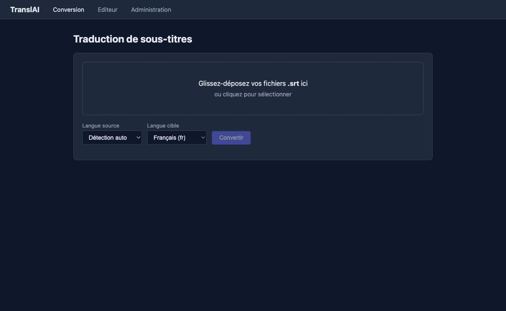
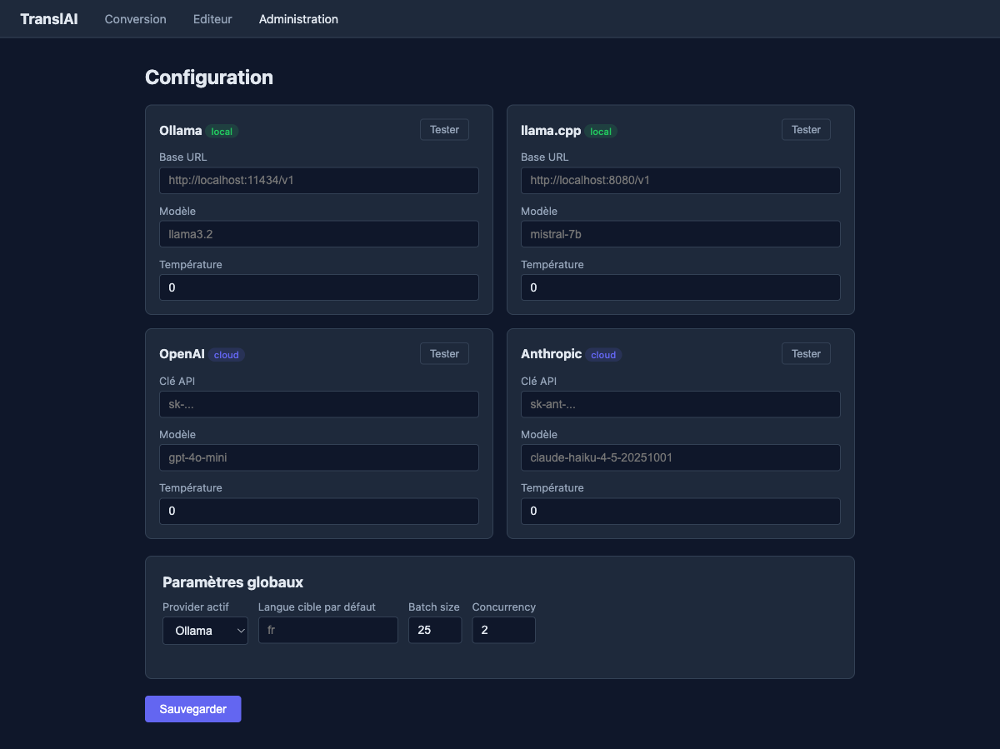

# TranslAI

Traducteur de sous-titres `.srt` via LLM — CLI Go + interface web HTMX.

Fonctionne avec **Ollama**, **llama.cpp**, **OpenAI**, **Anthropic**, **Gemini** ou tout endpoint OpenAI-compatible.  
Préserve **index, timestamps et tags de formatage** (`<i>`, `{\an8}`) : seul le texte est traduit.

---

## Sommaire

- [Captures d'écran](#captures-décran)
- [Fonctionnalités](#fonctionnalités)
- [Prérequis](#prérequis)
- [Démarrage rapide (Docker Compose)](#démarrage-rapide-docker-compose)
- [Configurer les providers LLM](#configurer-les-providers-llm)
  - [Ollama (local)](#ollama-local)
  - [llama.cpp (local)](#llamacpp-local)
  - [OpenAI (cloud)](#openai-cloud)
  - [Anthropic (cloud)](#anthropic-cloud)
- [Interface web](#interface-web)
- [CLI](#cli)
  - [Traduction d'un fichier](#traduction-dun-fichier)
  - [Traduction en batch](#traduction-en-batch)
  - [Toutes les options](#toutes-les-options)
- [Configuration YAML](#configuration-yaml)
- [Architecture](#architecture)
- [Développement](#développement)
- [Fonctionnement interne](#fonctionnement-interne)

---

## Captures d'écran

**Page de conversion** — glisser-déposer un ou plusieurs `.srt`, choisir la langue cible, convertir.



**Page d'administration** — configurer les providers LLM et sélectionner le provider actif.



---

## Fonctionnalités

- Traduit des fichiers `.srt` en préservant index, timestamps et retours-ligne internes
- Détection automatique de la langue source (ou override manuel)
- Traitement par batch avec fenêtre de contexte (2–3 cues précédentes fournies au modèle)
- Retry automatique + fallback cue-par-cue si le modèle déraille
- Encodage : UTF-8 forcé en sortie, latin-1/Windows-1252 converti en entrée
- Interface web HTMX avec progression SSE et téléchargement direct
- Éditeur d'alignement source/cible avec flag des cues suspectes
- CLI complète pour les flux scriptés et la traduction en batch
- Binaire statique unique (`CGO_ENABLED=0`), pas de dépendances runtime

---

## Prérequis

| Chemin | Prérequis |
|---|---|
| Docker Compose | Docker 24+ et Docker Compose v2 |
| Build local | Go 1.23+ |
| Provider local | Ollama ou serveur llama.cpp accessible |
| Provider cloud | Clé API OpenAI, Anthropic ou Google AI Studio |

---

## Démarrage rapide (Docker Compose)

La stack inclut TranslAI + Ollama. Ollama est optionnel si vous utilisez un provider cloud.

**1. Cloner le dépôt**

```bash
git clone https://github.com/gabrielfareau/translai.git
cd translai
```

**2. Créer le dossier de configuration**

```bash
mkdir -p config
```

**3. Lancer les services**

```bash
docker compose up -d
```

L'interface web est disponible sur **http://localhost:8080**.

**4. Tirer un modèle Ollama** (première utilisation)

```bash
docker compose exec ollama ollama pull qwen2.5:7b
# ou : llama3.2, mistral, phi3, gemma2...
```

**5. Configurer le provider dans l'UI**

Aller sur http://localhost:8080/admin, renseigner l'URL Ollama et le modèle dans la card **Ollama**, sélectionner **Ollama** comme provider actif, puis **Sauvegarder**.

**6. Traduire**

Aller sur http://localhost:8080, déposer un fichier `.srt`, choisir la langue cible et cliquer **Convertir**.

**Arrêter les services**

```bash
docker compose down
# Le volume /config persiste la configuration et l'état des jobs de review.
```

---

## Configurer les providers LLM

### Ollama (local)

[Ollama](https://ollama.com) expose une API OpenAI-compatible sur le port 11434.

```bash
# Installer et démarrer Ollama
ollama serve                    # écoute sur 0.0.0.0:11434 par défaut
ollama pull qwen2.5:7b          # ou llama3.2, mistral-7b, phi3...
```

**Depuis la CLI :**

```bash
translai translate -i film.srt --target fr \
  --base-url http://localhost:11434/v1 \
  --model qwen2.5:7b
```

**Via config.yaml :**

```yaml
active_provider: ollama
providers:
  ollama:
    type: openai_compat
    base_url: http://localhost:11434/v1
    model: qwen2.5:7b
    temperature: 0.2
```

**Dans Docker Compose**, Ollama tourne sur le service `ollama`. TranslAI y accède via `http://ollama:11434/v1`. En mode CLI Docker (accès à l'hôte) :

```bash
docker run --rm -v "$PWD:/data" translai \
  translate -i /data/film.srt --target fr \
  --base-url http://host.docker.internal:11434/v1 \
  --model qwen2.5:7b
```

---

### llama.cpp (local)

[llama.cpp](https://github.com/ggerganov/llama.cpp) expose un serveur OpenAI-compatible via `llama-server`.

```bash
# Lancer le serveur llama.cpp
llama-server -m /path/to/model.gguf --port 8080 --host 0.0.0.0
```

**Depuis la CLI :**

```bash
translai translate -i film.srt --target fr \
  --base-url http://localhost:8080/v1 \
  --model mistral-7b
```

**Via config.yaml :**

```yaml
active_provider: llamacpp
providers:
  llamacpp:
    type: openai_compat
    base_url: http://localhost:8080/v1
    model: mistral-7b
    temperature: 0.2
```

> **Note :** llama.cpp ignore souvent le champ `model` — c'est le modèle chargé au démarrage du serveur qui est utilisé.

---

### OpenAI (cloud)

```bash
translai translate -i film.srt --target fr \
  --base-url https://api.openai.com/v1 \
  --model gpt-4o-mini \
  --api-key "$OPENAI_API_KEY"
```

**Via config.yaml :**

```yaml
active_provider: openai
providers:
  openai:
    type: openai_compat
    base_url: https://api.openai.com/v1
    model: gpt-4o-mini
    api_key: sk-...
    temperature: 0.2
```

Le type `openai_compat` fonctionne avec tout endpoint compatible : Mistral AI, Together AI, Groq, Azure OpenAI, etc.

---

### Anthropic (cloud)

**Via config.yaml :**

```yaml
active_provider: anthropic
providers:
  anthropic:
    type: anthropic
    model: claude-haiku-4-5-20251001
    api_key: sk-ant-...
    temperature: 0.2
```

Configurable directement dans la page **Administration** de l'interface web.

---

## Interface web

Lancer le serveur web :

```bash
# Build local
translai web --addr :8080 --config ./config/config.yaml

# Docker Compose (recommandé)
docker compose up -d
```

| Page | URL | Rôle |
|---|---|---|
| Conversion | `/` | Upload `.srt`, sélection langue, suivi SSE, téléchargement |
| Éditeur | `/review` | Alignement source/cible cue par cue, flag des anomalies |
| Administration | `/admin` | Configuration des providers et paramètres globaux |

---

## CLI

### Traduction d'un fichier

```bash
# Provider défini dans config.yaml
translai translate -i film.srt --target fr

# Ollama explicite
translai translate -i film.srt --target fr \
  --base-url http://localhost:11434/v1 --model llama3.2

# Langue source forcée (désactive la détection auto)
translai translate -i film.srt --source en --target fr --model llama3.2

# Fichier de sortie explicite (défaut : film.fr.srt)
translai translate -i film.srt --target fr -o film_traduit.srt
```

### Traduction en batch

```bash
# Tous les .srt d'un dossier
translai translate -i ./sous-titres/ --target fr --out-dir ./traduits/

# Glob
translai translate -i "./films/*.srt" --target fr --out-dir ./traduits/

# Plusieurs fichiers en parallèle
translai translate -i ./sous-titres/ --target fr --concurrency 4
```

### Toutes les options

```
Flags:
  -i, --input string        fichier .srt, dossier ou glob (requis)
      --target string       langue cible, code ISO (requis) : fr, en, es, de, it...
      --source string       langue source (code ISO ou 'auto') (défaut: auto)
      --model string        modèle LLM (ex: llama3.2, gpt-4o-mini)
      --base-url string     endpoint OpenAI-compatible (défaut: http://localhost:11434/v1)
      --api-key string      clé API (vide pour les modèles locaux)
      --temperature float   température d'échantillonnage (défaut: 0.2)
      --batch-size int      cues par requête LLM (défaut: 25)
      --concurrency int     fichiers en parallèle (mode batch)
      --provider string     override du provider défini dans config.yaml
      --config string       chemin vers config.yaml
  -o, --output string       fichier de sortie (mode fichier unique)
      --out-dir string      dossier de sortie (mode batch)
  -v, --verbose             logs détaillés
```

La progression s'affiche sur stderr. Code retour ≠ 0 si la traduction échoue.

---

## Configuration YAML

Emplacement par défaut : `./config/config.yaml` (créé automatiquement si absent).

```yaml
active_provider: ollama       # provider utilisé par défaut
default_target: fr            # langue cible par défaut dans l'UI
batch_size: 25                # cues par requête LLM
concurrency: 2                # fichiers en parallèle (mode batch)

providers:
  ollama:
    type: openai_compat
    base_url: http://localhost:11434/v1
    model: qwen2.5:7b
    temperature: 0.2

  llamacpp:
    type: openai_compat
    base_url: http://localhost:8080/v1
    model: mistral-7b
    temperature: 0.2

  openai:
    type: openai_compat
    base_url: https://api.openai.com/v1
    model: gpt-4o-mini
    api_key: sk-...
    temperature: 0.2

  anthropic:
    type: anthropic
    model: claude-haiku-4-5-20251001
    api_key: sk-ant-...
    temperature: 0.2
```

Le fichier est créé avec les permissions `0600` (lecture réservée à l'utilisateur courant).  
Les clés API sont masquées dans l'UI (`sk-***ant`) — jamais exposées dans les logs ni les réponses HTTP.

---

## Architecture

```
translai/
├── cmd/translai/               # Point d'entrée Cobra (CLI + web)
│   └── main.go                 # Aucune logique métier ici
│
├── internal/
│   ├── srt/                    # Parser/sérialiseur SRT (go-astisub)
│   ├── detect/                 # Détection de langue (lingua-go)
│   ├── translate/              # Interface Translator + providers
│   │   ├── openai_compat.go    # Ollama, llama.cpp, OpenAI...
│   │   ├── anthropic.go        # API Anthropic Messages
│   │   ├── gemini.go           # API Google Gemini
│   │   └── prompt.go           # Prompt indexé [N] texte
│   ├── core/                   # Pipeline parse→detect→chunk→translate→reassemble
│   ├── config/                 # Config YAML + Store thread-safe (masquage clés API)
│   └── server/                 # Serveur HTTP HTMX
│       ├── server.go           # Router chi, middleware sécurité, lifecycle
│       ├── handlers_convert.go # POST /api/convert, SSE, download
│       ├── handlers_admin.go   # GET/POST /api/config, test-provider
│       ├── handlers_review.go  # Éditeur d'alignement
│       ├── store.go            # JobStore + ReviewStore en mémoire + write-behind
│       └── web/                # Assets embarqués (//go:embed)
│           ├── templates/      # HTML (layout, convert, admin, review)
│           └── static/         # CSS, JS, htmx.min.js
│
├── testdata/                   # Fixtures .srt (en, fr, es)
├── docs/
│   ├── PLAN.md                 # Plan de build par phases
│   ├── spec/                   # Specs par package
│   └── screenshots/            # Captures UI
├── Dockerfile                  # Multi-stage → distroless:nonroot
└── docker-compose.yml          # TranslAI + Ollama
```

**Dépendances principales**

| Package | Usage |
|---|---|
| `github.com/spf13/cobra` | CLI |
| `github.com/asticode/go-astisub` | Parse/sérialise SRT |
| `github.com/pemistahl/lingua-go` | Détection de langue |
| `github.com/go-chi/chi/v5` | Router HTTP |
| `gopkg.in/yaml.v3` | Configuration |
| `log/slog` | Logs structurés |

---

## Développement

```bash
make test               # tests unitaires
make check              # gate complet : vet + lint + test + build
make build              # → ./translai (statique, CGO désactivé)
make docker-test        # gate en conteneur (golangci-lint inclus)
make test-integration   # tests vs Ollama réel (tag integration)
```

---

## Fonctionnement interne

```
┌─────────────┐
│  .srt input │
└──────┬──────┘
       │ Parse (astisub) — préserve index, timestamps, tags
       ▼
┌──────────────┐
│  Détection   │  lingua-go → code ISO  (ou override --source)
│  de langue   │
└──────┬───────┘
       │
       ▼
┌──────────────────────────────────────────────────────┐
│  Chunking  (batch_size cues + 2-3 cues de contexte) │
└──────┬───────────────────────────────────────────────┘
       │  pour chaque batch :
       ▼
┌─────────────────────────────────────────────────────────────┐
│  Prompt indexé   [1] texte_1 \n [2] texte_2 \n ...         │
│  → LLM (openai_compat / anthropic / gemini)                 │
│  ← [1] traduction_1 \n [2] traduction_2 \n ...             │
│                                                             │
│  Validation : len(out) == len(in) ?                         │
│    NON → retry une fois → fallback cue-par-cue              │
│    OUI → réinjection dans la structure SRT originale        │
└──────┬──────────────────────────────────────────────────────┘
       │
       ▼
┌─────────────┐
│ .srt output │  index et timestamps identiques, texte traduit
└─────────────┘
```

**Invariants garantis :**
- Index et timestamps jamais modifiés
- Le fichier de sortie est toujours un SRT valide (le fallback cue-par-cue empêche toute corruption)
- Encodage de sortie toujours UTF-8
- Clés API jamais exposées dans les logs, les URLs ou les réponses HTTP
